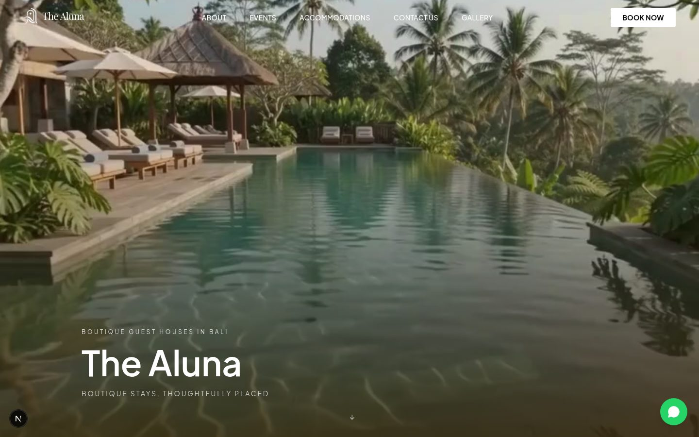
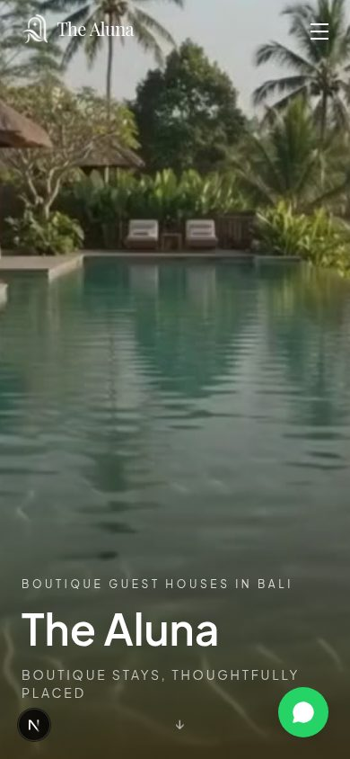
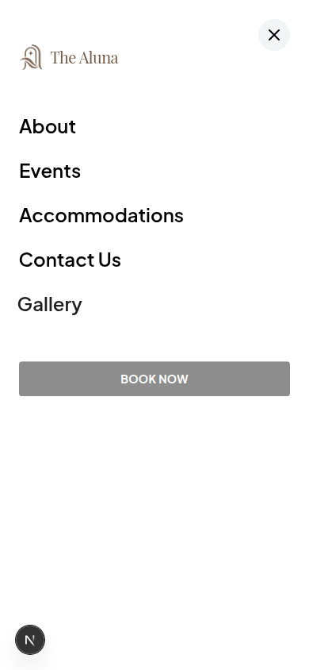
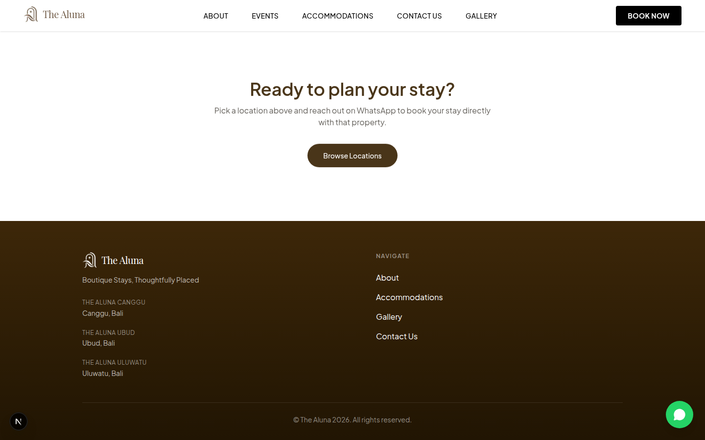

## The Aluna — Boutique Guest House Booking Site

A multi-property hotel booking site for a fictional Bali guest house brand,
built to closely match a real reference site's structure, motion design, and
visual language — then adapted to its own data model, content, and booking
flow (WhatsApp instead of a payment gateway).

**Stack**: Next.js 16 (App Router) · TypeScript · Tailwind CSS v4 ·
Framer Motion · Supabase (optional) · deployed on Vercel

### Screenshots

| Desktop hero | Mobile hero | Mobile menu |
| --- | --- | --- |
|  |  |  |



### Highlights

- **Video hero with scroll parallax** — autoplaying background video (muted,
  looped, `prefers-reduced-motion`-aware fallback to a static poster), with
  a scroll-linked drift built on Framer Motion's `useScroll`/`useTransform`.
- **Scroll-scrubbed gallery** — a horizontal image grid whose active "word"
  (Stay / Explore / Enjoy) and image set are driven by scroll position
  rather than a click-through carousel.
- **Multi-property architecture** — one brand-level homepage plus a
  per-property page (`/properties/[slug]`) generated from the same
  components, each with its own hero, room list, amenities, and gallery.
- **Optional backend** — the whole app runs on typed mock data
  (`lib/mock-data.ts`) with zero setup; wiring up Supabase env vars switches
  every page to live data with no code changes (see `lib/data.ts`).
- **WhatsApp-first booking** — every "Book Now" / "Contact Us" CTA opens a
  pre-filled `wa.me` chat naming the specific property, rather than a form
  (see `lib/whatsapp.ts`).
- **Animated navbar** — transparent over the hero, slides to a solid header
  with a color-swapped logo on scroll; a full slide-in mobile menu with
  staggered link entrance.

### Project structure

Both the brand site and each property are **single scrolling pages**, like
the reference site: the navbar links are anchors (`#about`, `#gallery`, ...)
that scroll to a section on that same page, not separate routes.

```
app/
  page.tsx                          Brand homepage: hero, #about, #locations
                                     (every property), #gallery, #contact
  properties/[slug]/
    layout.tsx                      Fetches the property, renders its navbar/footer
    page.tsx                        Renders <PropertyLanding>
components/
  hero.tsx                          Shared hero (video + eyebrow/title/tagline), used by
                                     both the homepage and property pages
  property-landing.tsx              A property's full page: hero, #about, room
                                     carousel, #rooms, amenities, #gallery
  navbar.tsx, footer.tsx, logo.tsx, reveal.tsx (scroll-in animation),
  feature-carousel.tsx, scroll-gallery.tsx, room-card.tsx, amenities-list.tsx,
  whatsapp-button.tsx               Floating "chat on WhatsApp" button
lib/
  brand.ts                          Brand-level copy (name, tagline, hero image) for "/"
  data.ts                           Data access layer (Supabase, falls back to mock data)
  mock-data.ts                      Sample property/room data for local dev
  whatsapp.ts                       Builds wa.me links for every "Book Now" CTA
  supabase/                         Supabase client factory
supabase/schema.sql                 Table definitions, RLS policies, and seed data
```

### Local development

```bash
npm install
npm run dev
```

The app works out of the box with **mock data** (`lib/mock-data.ts`) even
without a Supabase project — useful for building/reviewing UI first.

### Connecting Supabase

1. Create a project at [supabase.com](https://supabase.com).
2. In the SQL editor, run `supabase/schema.sql`. This creates the
   `properties` and `room_types` tables (public read via row-level security)
   and inserts sample properties with their rooms. It also creates an
   `inquiries` table for possible future use, but nothing in the app writes
   to it currently — booking goes through WhatsApp instead.
3. Copy `.env.example` to `.env.local` and fill in the values from
   **Project Settings → API**:

   ```bash
   cp .env.example .env.local
   ```

   ```
   NEXT_PUBLIC_SUPABASE_URL=https://xxxx.supabase.co
   NEXT_PUBLIC_SUPABASE_ANON_KEY=eyJ...
   ```

4. Restart `npm run dev`. Pages now read live data from Supabase instead of
   the mock data.
5. Manage properties, room types, and prices directly from the Supabase
   **Table Editor** — there's no admin dashboard yet by design (see below).

To add more properties, insert rows into `properties` / `room_types` via the
Supabase Table Editor. They'll appear automatically in the homepage's
"Our Locations" section and at `/properties/<slug>`.

### How booking works

"Book Now" buttons and the floating WhatsApp button (`components/
whatsapp-button.tsx`, `lib/whatsapp.ts`) open a pre-filled `wa.me` chat
rather than submitting a form. Swap the placeholder `WHATSAPP_NUMBER` in
`lib/whatsapp.ts` for the real business number before launch.

### Deploying to Vercel

1. Push this repo to GitHub.
2. Import it in [Vercel](https://vercel.com/new).
3. Add the same two environment variables (`NEXT_PUBLIC_SUPABASE_URL`,
   `NEXT_PUBLIC_SUPABASE_ANON_KEY`) in the Vercel project settings.
4. Deploy.

### Not built yet (out of scope for this pass)

- Admin dashboard (managing properties/rooms is done via Supabase directly)
- Real-time room availability and online payment — booking is a WhatsApp
  handoff, followed up manually
- Authentication for guests or staff
